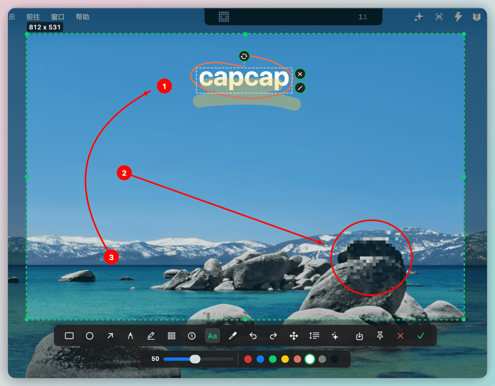
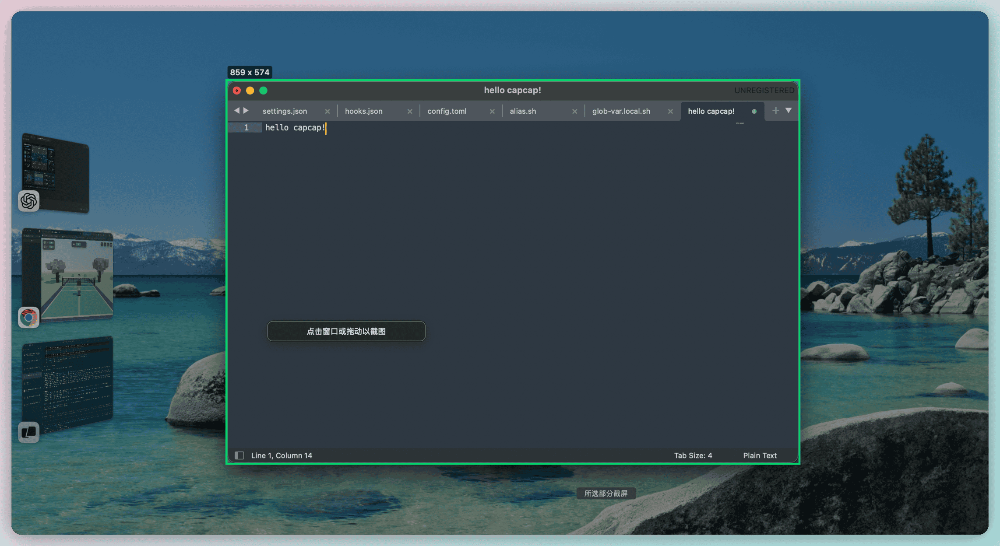
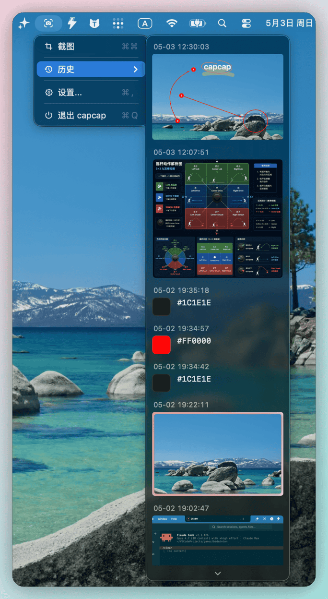
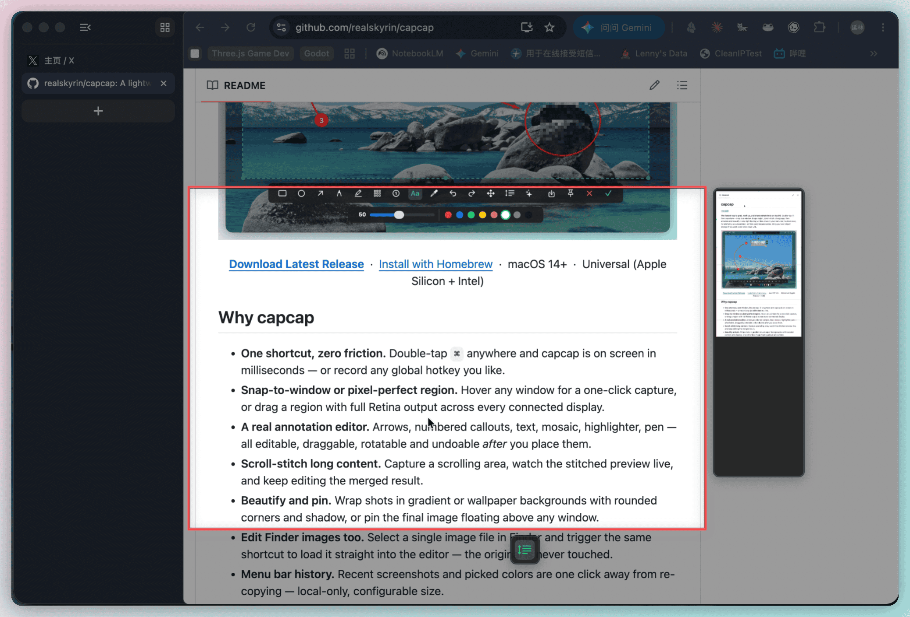
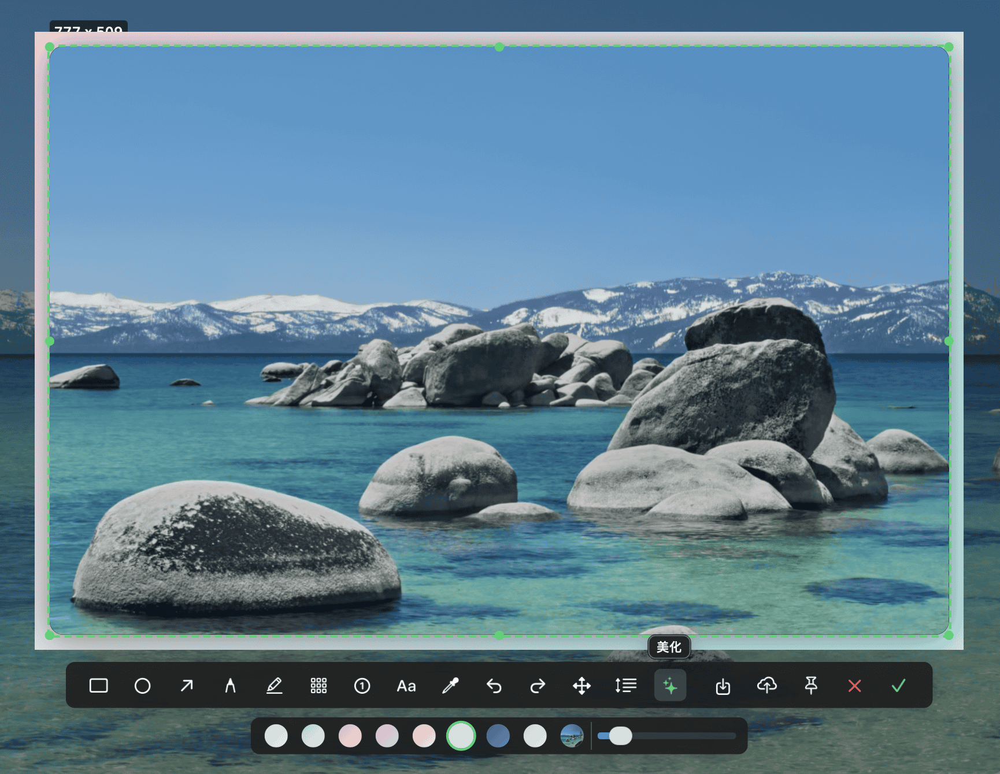

<p align="center">
  
</p>

<h1 align="center">capcap</h1>

<p align="center">
  Outil de capture d'écran pour la barre des menus macOS : double-cliquez sur <code>⌘</code> pour capturer, annoter, assembler une longue page, embellir, épingler et téléverser.
</p>

<p align="center">
  <a href="https://github.com/realskyrin/capcap/releases/latest"></a>
  
  
  <a href="LICENSE"></a>
</p>

<p align="center">
  <a href="README.md">简体中文</a> ·
  <a href="README.zh-TW.md">繁體中文</a> ·
  <a href="README.en.md">English</a> ·
  <a href="README.ja.md">日本語</a> ·
  <a href="README.ko.md">한국어</a> ·
  <a href="README.fr.md">Français</a> ·
  <a href="README.ru.md">Русский</a> ·
  <a href="README.vi.md">Tiếng Việt</a>
</p>

<p align="center">
  <a href="https://github.com/realskyrin/capcap/releases/latest">Télécharger</a> ·
  <a href="https://github.com/realskyrin/homebrew-tap">Homebrew</a> ·
  <a href="CHANGELOG.md">Changelog</a> ·
  <a href="https://github.com/realskyrin/capcap/issues">Issues</a>
</p>

**Le moyen le plus rapide de capturer, annoter et partager des captures d'écran sur macOS.** Double-cliquez sur `⌘` depuis n'importe quelle app, capturez une fenêtre ou une zone, assemblez une page longue, puis annotez et embellissez dans une fenêtre flottante. capcap vit dans la barre des menus, sans icône Dock, sans télémétrie, sans abonnement et sans dépendance tierce. Vous pouvez connecter votre propre stockage d'images pour copier une URL publique en un clic.

<p align="center">
  
</p>

## Pourquoi capcap

- **Un raccourci, aucun frottement** : double-cliquez sur `⌘` ou utilisez votre raccourci global personnalisé.
- **Fenêtre ou zone précise** : cliquez une fenêtre détectée, ou faites glisser une zone avec sortie Retina.
- **Un vrai éditeur d'annotations** : flèches, numéros, texte, mosaïque, surligneur et stylo restent modifiables après placement.
- **Capture longue** : faites défiler dans la zone sélectionnée, prévisualisez l'assemblage, puis continuez l'édition.
- **Embellir et épingler** : ajoutez fond, arrondis, ombre et marges, ou gardez l'image au-dessus des autres fenêtres.
- **Modifier les images Finder** : sélectionnez une image dans Finder et ouvrez-la directement dans l'éditeur sans toucher au fichier d'origine.
- **Historique local** : recopiez rapidement captures, couleurs et liens depuis la barre des menus.
- **Téléversement vers votre hébergeur** : Tencent COS, Qiniu Kodo et Aliyun OSS sont pris en charge. Les identifiants restent sur votre Mac.
- **AppKit pur** : pas de SwiftUI, pas d'Electron, pas de télémétrie.

## Aperçu

<table>
<tr>
  <td width="50%" align="center"><br/><sub><b>Capture de fenêtre en un clic</b><br/>capcap détecte automatiquement les bords.</sub></td>
  <td width="50%" align="center"><br/><sub><b>Historique dans la barre des menus</b><br/>Recopiez vite les captures et couleurs récentes.</sub></td>
</tr>
<tr>
  <td width="50%" align="center"><br/><sub><b>Assembler les longues pages</b><br/>Faites défiler et voyez le résultat en direct.</sub></td>
  <td width="50%" align="center"><br/><sub><b>Embellissement en un clic</b><br/>Fond, arrondis, ombre et marges réglables.</sub></td>
</tr>
<tr>
  <td colspan="2" align="center"><br/><sub><b>Hébergement d'images</b><br/>Téléversez et copiez l'URL publique dans le presse-papiers.</sub></td>
</tr>
</table>

## Prérequis

- macOS 14.0 ou plus récent
- Permission Accessibilité pour le déclencheur `⌘`
- Permission Enregistrement de l'écran pour ScreenCaptureKit
- Permission Automatisation Finder pour modifier l'image sélectionnée

## Installation avec Homebrew

```bash
brew tap realskyrin/tap
brew install --cask realskyrin/tap/capcap
```

## Compilation depuis les sources

```bash
./scripts/bundle.sh
```

Pour le développement local :

```bash
bash scripts/rebuild-and-open.sh
```

## Utilisation

1. Double-cliquez sur `⌘ Command`, utilisez votre raccourci ou choisissez la capture dans la barre des menus.
2. Cliquez une fenêtre ou faites glisser une zone.
3. Utilisez la barre flottante pour annoter, choisir une couleur, capturer en défilement, embellir, enregistrer, épingler, téléverser ou confirmer.
4. Cliquez la coche verte ou appuyez sur `Enter` pour copier le résultat. `Esc` ou `x` annule.

## Outils d'édition

| Outil | Rôle |
| --- | --- |
| Rectangle / ellipse | Dessiner des formes avec couleur et épaisseur |
| Flèche | Dessiner une flèche et ajuster points ou courbe ensuite |
| Stylo / surligneur | Tracer à main levée ou surligner |
| Mosaïque | Pixelliser les zones sensibles |
| Numéro / texte | Ajouter des repères numérotés ou du texte éditable |
| Pipette | Copier une couleur d'écran en `#RRGGBB` |
| Capture longue / embellir / épingler / téléverser | Finaliser et partager l'image |

## Réglages

Les réglages couvrent la langue, l'icône de barre des menus, le lancement à l'ouverture de session, le mode démo, les raccourcis, la taille de l'historique, l'hébergeur d'images et les accès rapides aux permissions. L'interface prend en charge 简体中文, 繁體中文, English, 日本語, 한국어, Français, Русский et Tiếng Việt.

## Licence

[MIT](LICENSE)
